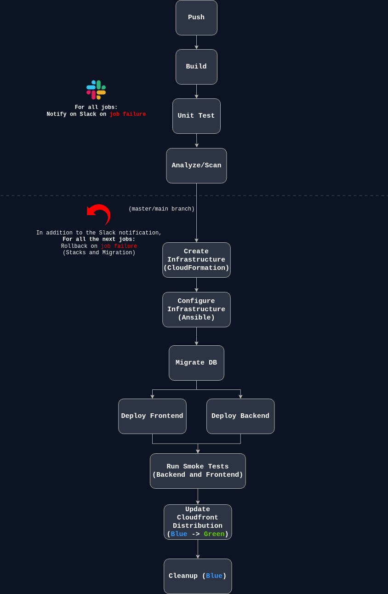

## Advanced Cloud DevOps Nanodegree Project 3:
# Give your Application Auto-Deploy Superpowers

 

### Learning objectives:

- Explain the benefits of CI/CD to achieve, build, and deploy automation for cloud-based software products.
- Utilize Deployment Strategies to design and build CI/CD pipelines that support Continuous Delivery processes.
- Utilize a configuration management tool to accomplish deployment to cloud-based servers.
- Surface critical server errors for diagnosis using centralized structured logging.

## CI/CD Pipeline Diagram

 

### Built With

 

  

         
          
          

- [Circle CI](www.circleci.com) - Cloud-based CI/CD service
- [Amazon AWS](https://aws.amazon.com/) - Cloud services
- [AWS CLI](https://aws.amazon.com/cli/) - Command-line tool for AWS
- [CloudFormation](https://aws.amazon.com/cloudformation/) - Infrastrcuture as code
- [Ansible](https://www.ansible.com/) - Configuration management tool
- [Prometheus](https://prometheus.io/) - Monitoring tool
___
### Project specifications

  | Specifications | Proof | Meets specifications |
  |---|---|---|
  | Job failed because of compile errors. | [SCREENSHOT01](./screenshots/SCREENSHOT01.png) | ✓ |
  | Job failed because of unit tests (backend). | [SCREENSHOT02-BE](./screenshots/SCREENSHOT02-BE.png) | ✓ |
  | Job failed because of unit tests (frontend). | [SCREENSHOT02-FE](./screenshots/SCREENSHOT02-FE.png) | ✓ |
  | Job that failed because of vulnerable packages (backend). | [SCREENSHOT03-BE](./screenshots/SCREENSHOT03-BE.png) | ✓ |
  | Job that failed because of vulnerable packages (frontend). | [SCREENSHOT03-FE](./screenshots/SCREENSHOT03-FE.png) | ✓ |
  | An alert from one of your failed builds (slack). | [SCREENSHOT04-SLACK](./screenshots/SCREENSHOT04-SLACK.png) | ✓ |
  | An alert from one of your failed builds (email). | [SCREENSHOT04-EMAIL](./screenshots/SCREENSHOT04-EMAIL.png) | ✓ |
  | Appropriate job failure for infrastructure creation. | [SCREENSHOT05](./screenshots/SCREENSHOT05.png) | ✓ |
  | Appropriate job failure for the smoke test job. | [SCREENSHOT06](./screenshots/SCREENSHOT06.png) | ✓ |
  | Successful rollback after a failed smoke test. | [SCREENSHOT07](./screenshots/SCREENSHOT07.png) | ✓ |  
  | Successful promotion job. | [SCREENSHOT08](./screenshots/SCREENSHOT08.png) | ✓ |
  | Successful cleanup job. | [SCREENSHOT09](./screenshots/SCREENSHOT09.png) | ✓ |
  | Only deploy on pushed to `master` branch. | [SCREENSHOT10](./screenshots/SCREENSHOT10.png) | ✓ |
  | Provide a screenshot of a graph of your EC2 instance including available memory, available disk space, and CPU usage.| [Memory](./screenshots/SCREENSHOT11-MEMORY.png), [Disk](./screenshots/SCREENSHOT11-DISK.png), [CPU](./screenshots/SCREENSHOT11-CPU.png) | ✓ |
  | Provide a screenshot of an alert that was sent by Prometheus. | [SCREENSHOT12](./screenshots/SCREENSHOT12.png) | ✓ |
  | Public Url to GitHub repository (not private) | [URL01](https://github.com/mostafaibrahim24/cicd-configurationmanagement-monitoring-logging-nanodegree-project) | ✓ |
  | Public URL for your S3 Bucket (aka, your green candidate front-end) | [URL02](http://udapeople-5a2b048.s3-website-us-east-1.amazonaws.com/#/employees) | ✓ |
  | Provide a screenshot showing the evidence of deployed and functioning front-end application (aka, your production front-end) S3 Bucket | [URL03_SCREENSHOT_S3](./screenshots/URL03_SCREENSHOT.png) | ✓ |
  | Provide a screenshot showing the evidence of deployed and functioning front-end application (aka, your production front-end) Cloudfront | [URL03_SCREENSHOT_CF](./screenshots/SCREENSHOT-CF-URL.png) | ✓ |
  | Screenshot of cloudfront distribution being up. | [SCREENSHOT-CF](./screenshots/SCREENSHOT_cloudfront_up_console.png) | ✓ |
  | Provide a screenshot showing the evidence of a healthy backend application. The backend endpoint status should show a healthy response. | [URL04_SCREENSHOT](./screenshots/URL04_SCREENSHOT.png) | ✓ |
  | Provide a screenshot of your Prometheus server showing UP state. | [URL05_SCREENSHOT](./screenshots/URL05_SCREENSHOT.png) | ✓ |

- Your presentation should be in PDF format and named [presentation.pdf](./presentation.pdf). ✓
- Note that the URLs are broken now, because the infrastructure was destroyed after completing the project.

### License

[License](LICENSE.md)
